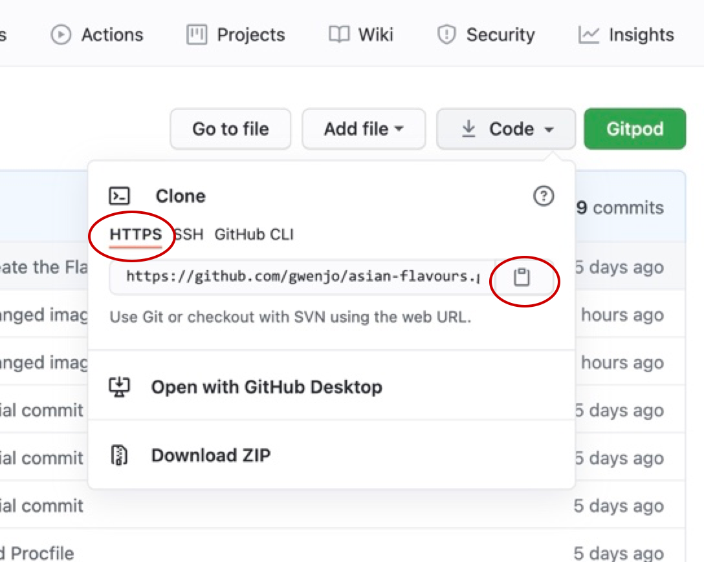
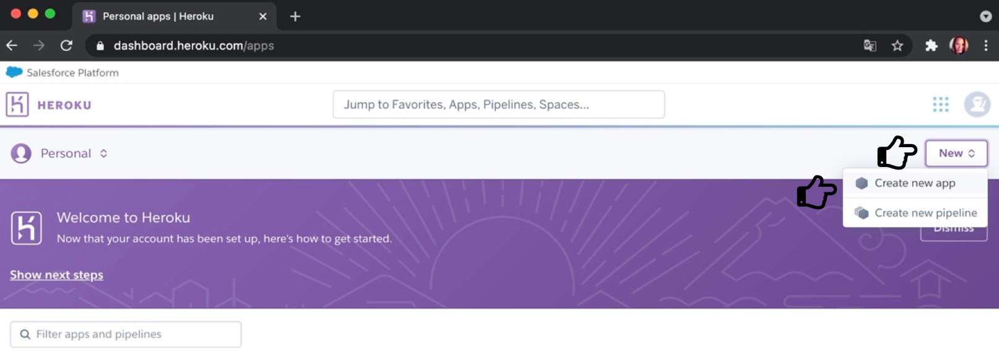
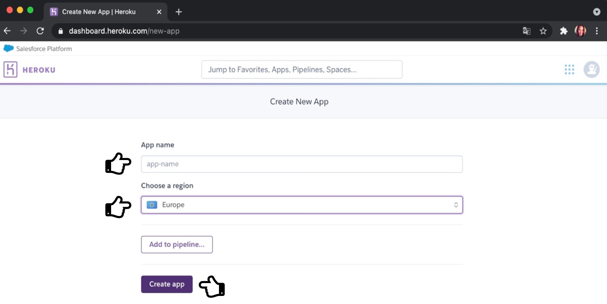
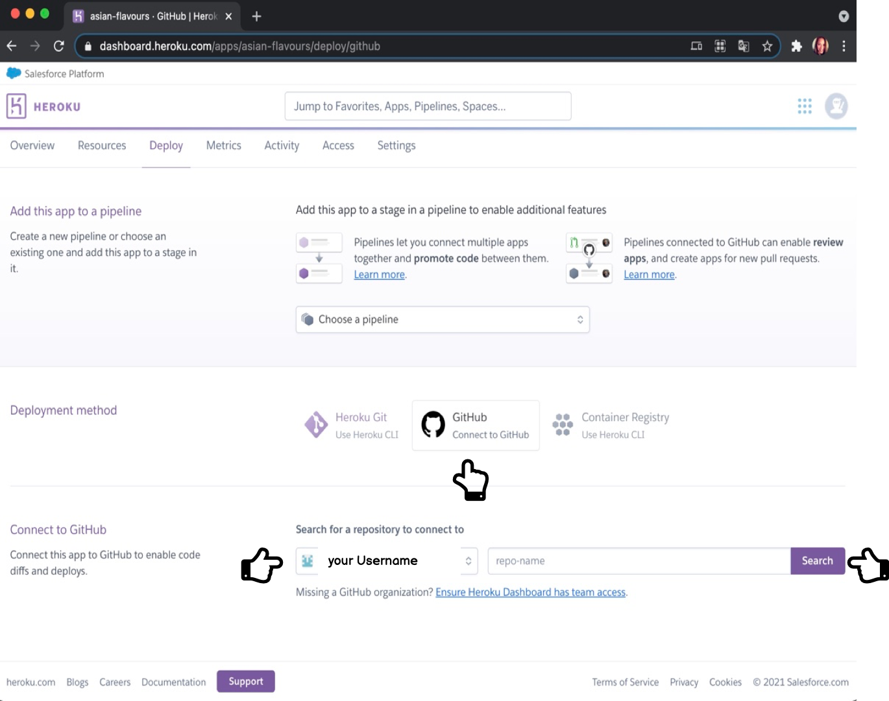
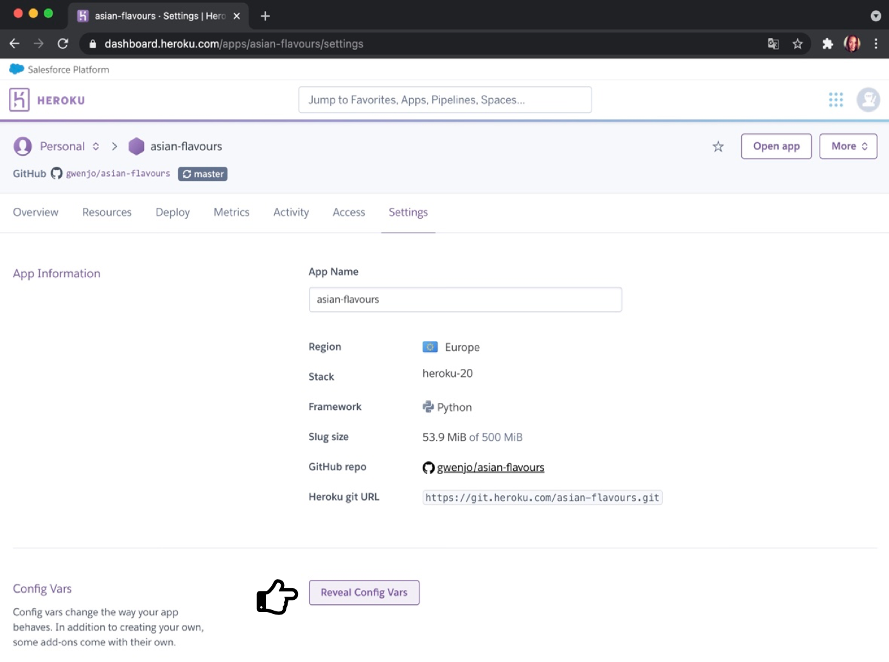
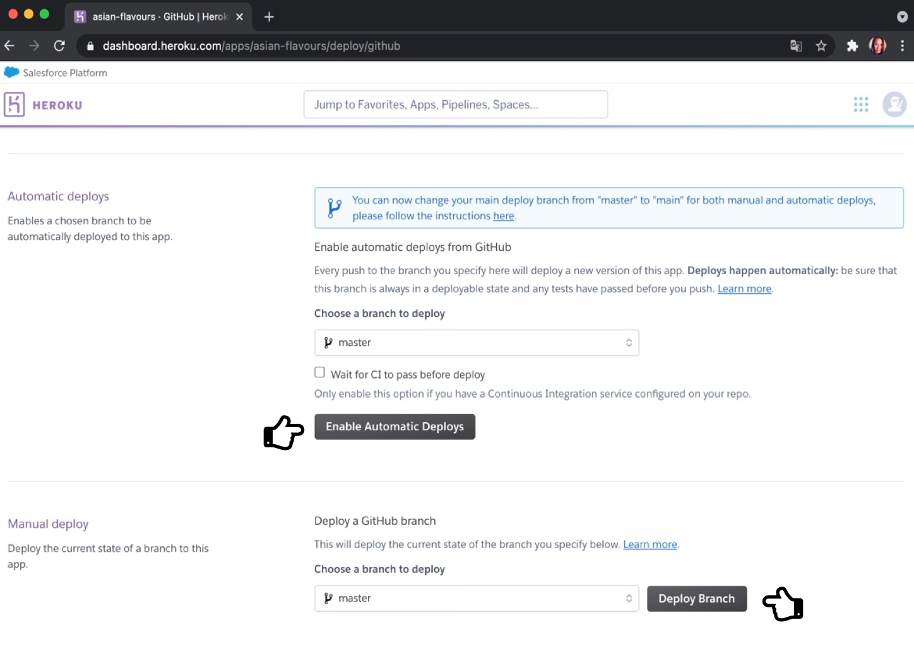
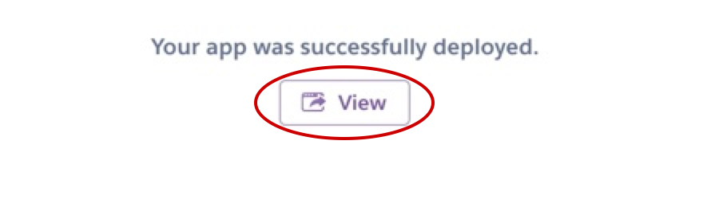

# **Milestone Project 3**
**THIS PROJECT IS FOR EDUCATIONAL USE ONLY**

**Asian Flavours**

Welcome to Asian flavor. 
The purpose of this website is that people can share different (preferably Asian) dishes with each other. You can do this by registering yourself. If you are registered you can sign in and sign out, keep track of recipes, change and delete your own recipes.

Come and share your favorite asian meals!  

Don't wait any longer and Sign Up! !

[live site Asian Flavour](https://)

## **Contents** ##
* UX
    * [Project Summary](#project-summary)
    * [User Stories](#user-stories)
    * [Design Choices](#design-choices)
* [Wireframes](#wireframes)
* [Features](#features)

* [Technologies](#technologies)
* [Testing](#testing)
* [Fixed Issues](#fixed-issues)
* [Deployment](#deployment)
* [Credit](#credits)

## **UX (User Experience)** ##
### **Project Summary** ###

The goal of this project is (CRUD) to create a database of recipes that allows users to add, read, update and delete recipes.
Asian Flavors gives access to all recipes in the database for all registered and unregistered users. Registered users can add new recipes, edit and delete their own recipes.

### ** UX **
** First time user **

-	As a first user, I want to be able to register easily.
-   As a first time user, I want an easy navigation website so that I can add 
    and see my (new) recipes.
-	As a first user, I want a clear looking website so that the recipes are         easy to follow.

** Returning Users **

-	As a returning user, I want to be able to sign in and out easily.
-   As a returning user, I want to be able to edit and/or delete my added 
    recipes.
-   As a returning user, I would like to see all added recipes without logging 
    in.

** Site owner’s Goal: **

•	As the site owner, I want the user to have an easily accessible site.
•	As the site owner, I want the user to be able to see all recipes added by       the registered users.

### **Design choices**

The chosen design for this website is clear and user-friendly.

In the navigation and throughout the website there are several buttons that lead you back to the homepage.

**Framework**

* Front-end framework, [Materialize](https://materializecss.com/)
was used for this website. It was used to create features such as navigation bar, forms and buttons.

* [JQuery](https://jquery.com/) was used to initialize some Materialize elements.

* Micro framework [Flask](https://flask.palletsprojects.com/en/1.1.x/), 
for this website flask was chosen to build the backend.

**Typography**
- I used [Google Fonts](https://fonts.google.com/specimen/Roboto) for the font style of this project. The font used for this website is Roboto with a backup font of Sans-serif. It is a simple and easy to read font. The font is also easy to read on smaller devices.

**Icons**
  - An existing favicon has been chosen for this website[Favicon](https://favicon.io/). 
  - FontAwesome](https://fontawesome.com/) was used for my forms and buttons, to make it more appealing.

- **Colour Scheme**

For this website I used different shades of pink.

Green was used for the edit button

Red has been used for the delete button.

There are also shades of gray.

**Main colour palette**
Kleuren nog uitwerken!!!

page-header 
    color: #880e4f

home-image h1
    color: #fff

---
## **Wireframes**
For the user stories I used [Balsamiq](https://balsamiq.com/) to create a nice and simple layout for the desktop and mobile screen.
Links to the wireframes can be found here:

Desktop Wireframes  

Desktop Wireframe, for bigger image [Click here](readme-documents/)

Tablet Wireframe, for bigger image [Click here](readme-documents/)

Mobile Wireframe  

Mobile Wireframe, for bigger image [Click here](readme-documents/)

Note: There were some layout changes. The result is not quite the same as the examples of the wireframes.
 
---

## **Features**

**Features Left to Implement**
-   Entering an email address for newsletter.
-   Leave a comment underneath a recipe (for account members only).
-   Rate the recipe.

---
## **Technologies**

**Deployment**
  * [Heroku](https://dashboard.heroku.com/)
  * [Git](https://git-scm.com/)
  * [Github](https://github.com/)
  * [Gitpod](https://gitpod.io/)

**Front-End**

  - [HTML5](https://en.wikipedia.org/wiki/HTML)
    - To give the page its structure and presenting static data.
    - All HTML files are located within the 'templates' directory.
  - [CSS](https://en.wikipedia.org/wiki/CSS)
    - CSS has been used to style and customise the content of this project.
  - [Materialize](https://materializecss.com/)
    - This is a framework that I have used to simplify CSS classes, features that have been used and modified include the navbar, responsive design classes, and colors for backgrounds and text.
  - [JQuery](https://en.wikipedia.org/wiki/JQuery)
    - JQuery has been used to give the site its functionality as well as making DOM manipulation simpler.

- **Back-end**
  - [MongoDB](https://www.mongodb.com/) 
    - As the data entered by users can always be different from one to the next, the project uses MongoDB to store its data as MongoDB is a Document Based Database.
  - [Flask](https://flask.palletsprojects.com/en/2.0.x/)
    - Flask is a framework that allows developers to easily present data in an orderly fashion. All data entered by a user, such as the Recipe Name, is presented to users with a few lines of code embedded into the HTML.
      - Modules from Flask that have been included are:
      - Flask
      - flash
      - render_template
      - redirect
      - request
      - session
      - url_for
      - PyMongo
  - [bson.objectid](https://www.npmjs.com/package/bson-objectid)
      - ObjectId
  - [werkzeug.security](https://werkzeug.palletsprojects.com/en/1.0.x/utils/)
      - generate_password_hash
      - check_password_hash
  - [datetime](https://docs.python.org/3/library/datetime.html)
      - datetime
  - [Python](https://www.python.org/)
    - Python is working very closely with Flask to manipulate data and HTML across multiple pages within the app.

- **Validators**
  - The validators that have been used on the project are as followed:
    - [HTML Validator](https://validator.w3.org/nu/) - No issues apart from jinja templating
    - [CSS Validator](https://jigsaw.w3.org/css-validator/) - No issues
    - [JavaScript Validator](https://jshint.com/) - No issues 
    - [Python Validator](http://pep8online.com/) - No issues
---
## **Testing**
 
For the main foundation of this website I used Tim Nelson's Code Institute Task Manager Mini-Project. Then I modified it to my website

## **Deployment**

Github

How to clone code from GitHub:

1.  Go to [Github repository](https://github.com/gwenjo/asian-flavours), navigate to the main page and click Code:
2.  To Clone the repository using HTTPS, under "Clone" click HTTPS.

3.  Open Git Bash in your local IDE.
4.  Change your current working directory to where you want the cloned directory to be made.
5.  Type `$ git clone`, and paste the URL you copied earlier:
    `$ git clone https://github.com/YOUR-USERNAME/asian-flavours.git`
6. Press enter your local clone will be ready.

### **How to clone this repository to your device**
1.  Create an `env.py` file to store variables, also create .gitignore file to keep these from being displayed:
     - Import os 
     - os.environ.setdefault("IP", "value") 
     - os.environ.setdefault("PORT", "value") 
     - os.environ.setdefault("SECRET_KEY", " value") 
     - os.environ.setdefault("MONGO_URI", " value") 
     - os.environ.setdefault("MONGO_DBNAME", "value")

To properly explain the deployment to Heroku progress. I’ll give a detailed explanation below:

2.  Create a new application using the Heroku dashboard.
3. With `npm install -g Heroku` you can install Heroku.
4. Create a requirements.txt in the console using 
-	`pip3 freeze > requirements.txt`.
5. Create a Procfile via the console using 
`echo web: python app.py > Procfile`.
6. Go to [Heroku]( https://id.heroku.com/login) and login, on your dashboard on the right, click ‘New’ than ‘Create new app’:

    
Create an app name
Choose region closest to you:
Then click ‘Create app’:

    
3.  Than select:
-   Deploy
-   Deployment method and choose GitHub.
-   Search for a repository to connect to
-   Add your repository name,
-   Click the `Search` button,
-   If the repository is found, click `Connect` to connect to this app:

4.  Now go to `Settings`. Click `Reveal Config Vars`.

Here you can fill in the variables from the `env.py` file to securely tell Heroku which variables are required:
     - IP
     - PORT
     - MONGO_DBNAME
     - MONGO_URI
     - SECRET_KEY

5.  After adding the variables push requirements.txt and Profile to the repository
`$ git add requirements.txt`
`$ git commit -m “add requirements.txt”`

`$ git add Profile`
`$ git commit -m ”Profile”`

`$ git push`

6.  Go back to the Heroku page, and press ‘Enable Automatic Deployment’ and then click ‘Deploy Branch’.
    

7.  When Heroku is finished building you will see Your app was successfully deployed.
Click on ‘View’ to launch the app.
    

 

## **Credits**
- **Content and Media**
I want to reiterate that THIS PROJECT IS FOR EDUCATION USE ONLY. I have used different websites for different recipes.
The content and images used in this site were obtained from links below:
Images | Content

image from Bich Tran - Pexels.com
https://www.allrecipes.com/recipe/245343/authentic-vietnamese-spring-rolls-nem-ran-hay-cha-gio/#:

https://www.onceuponachef.com/recipes/cashew-chicken.html

image from Jan Ngyen - Pexels.com
https://www.feastingathome.com/thai-chicken-noodle-soup/

- **Resources**

  The resources used to create this project:

### **Acknowledgements**

 

**THIS PROJECT IS FOR EDUCATIONAL USE ONLY**